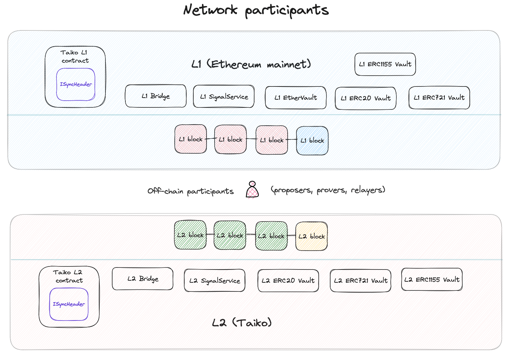
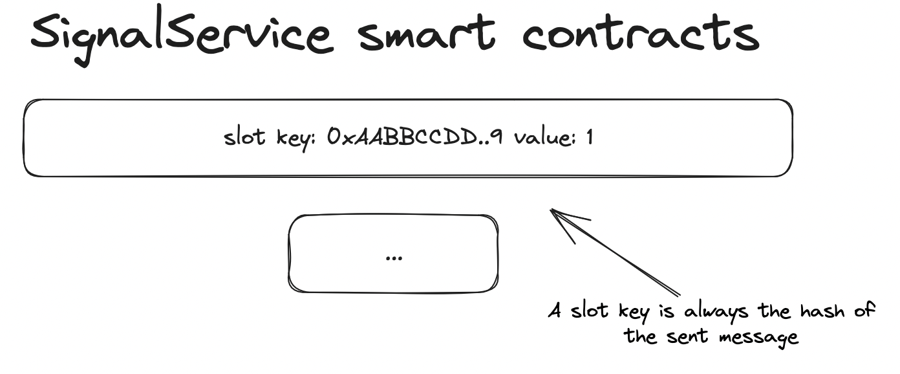

# Detailed bridging contract flow

## High level overview

For a high level - (semi-technical) - overview please check out README.md !

## Bridge network participants

Participants during bridging:

- **_Taiko L1 / L2 contracts:_** Would not elaborate on this too much because in the bridging process, they are providing info (block height / block hashes / signal roots) via _`ISyncHeader`_ to the _`Bridge`_ s.
- **_L1 / L2 Bridges:_** In case users are bridging `ether` only, they are directly interacting with the `Bridge` contracts by sending a _`message`_. In such case they are bridging other tokens types (`Erc20`, `Erc1155`, `Erc721`) - maybe together with `ether` in the same operation - they need to interact with the `ERCXXXVault` contracts.
- **_L1 / L2 Signal Services:_** This contracts stores a specific `signal` and it's state always on the source chain. (Please see diagram below what a signal is and how it is used.)
- **_L1 EtherVault:_** This contracts (on L1 only!) serves as the custody for the `ether` bridged. On L2 (Taiko) the bridge will hold the necessary `ether`.
- **_L1 ERCXXX Vault:_** They are responsible for initiating / processing / recalling transactions, as well as deployment of bridged tokens if necessary.
- **_Off-chain participants:_** `Proposers/provers` taking part in the bridging process by synchronizing the necessary header information (block height / block hashes / signal roots) and including transactions while the task of the (optional) `relayer` is to submit proofs and claim the funds on behalf of the users.

### Signal Service

The SignalService contract serves as a secure cross-chain message passing system. It defines methods for sending and verifying signals with merkle proofs. The trust assumption is that the target chain has secure access to the merkle root (such as Taiko injects it in the anchor transaction). With this, verifying a signal is reduced to simply verifying a merkle proof.

So on the destination chain (together with the proof) the counterpart contract can be sure that the exact same message - it just received - is registered (`sent`) also on the source chain.
